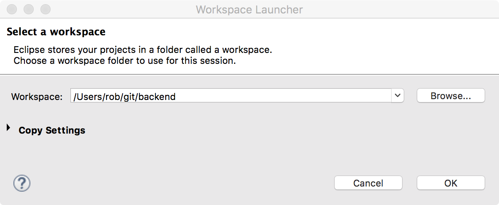
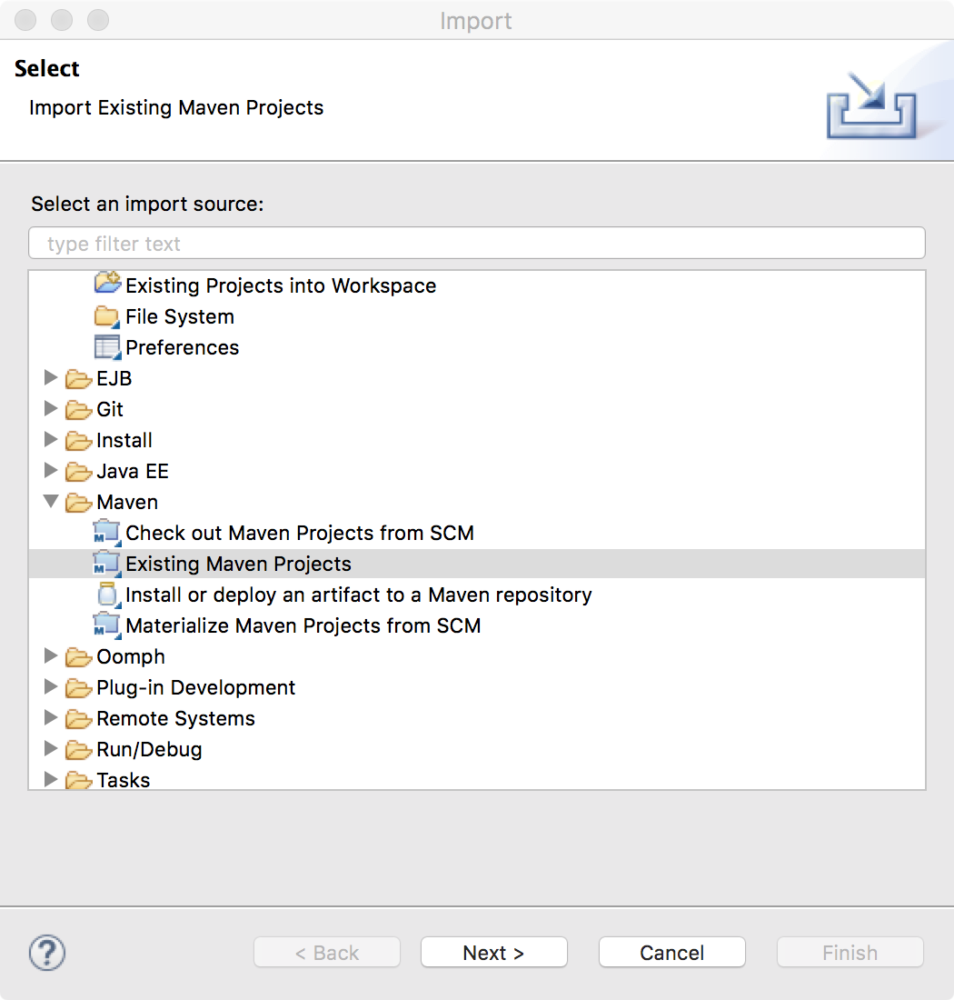
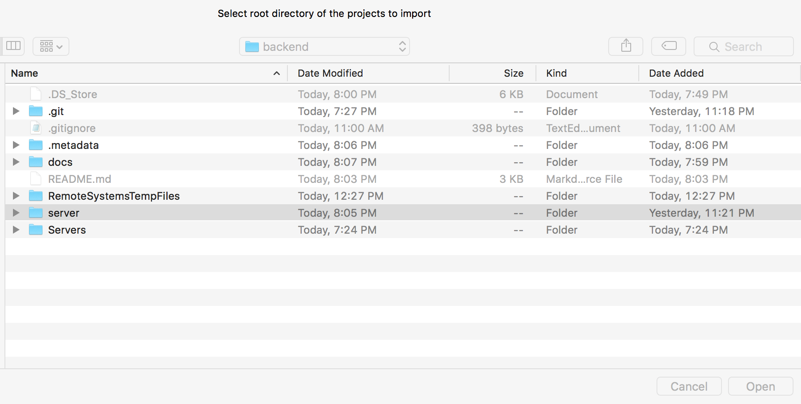
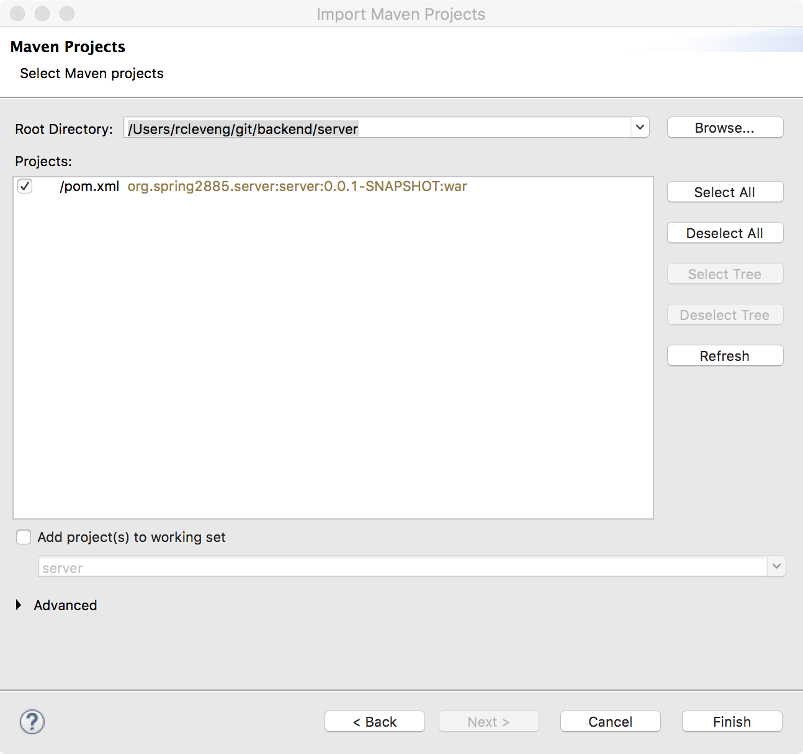
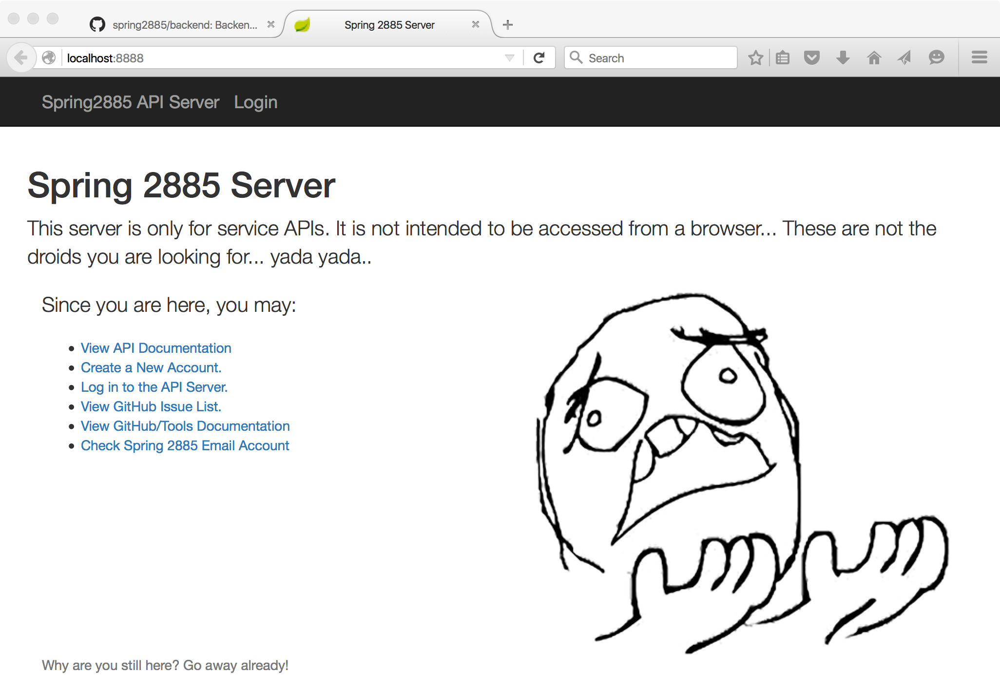

# backend
Backend Repository for Spring2885 (REST + Server Side Java + Database)


## Overview
Make sure you have the most recent version of the source code in your repository.  Use ````git pull upstream master```` followed by a ````git push```` to keep your local copy (and your fork on github) up to date.

This application is using Apache Maven and the Spring Boot libraries to bootstrap itself.  Note the maven will pull down (and cache locally) *lots* of dependencies, so the first time you run each of these commands I'd recommend being on a network with fast internet *(i.e. not the university)*.

## Setting up MySQL

Make sure you have MySQL 5.7 installed.  You'll need to create the backend user. For test/dev, we just
use the username of ```backend``` with the password of ```backend```.

Use the following commands to create your backend user and also
the schema with some sample data.

N.B. This assumes you are in the backend project directory.

```bash
cd database
mysql -uroot -p < create-backend-user.sql
mysql -ubackend -pbackend < backend.sql
mysql -ubackend -pbackend < backend-test-data.sql
```

## Eclipse IDE Instructions

Make sure you have the latest Eclipse installed, such as the Mars release (4.5.1).  Also you must install m2e plugins.  See [M2Eclipse: Setting up Eclipse IDE](http://www.eclipse.org/m2e/documentation/m2e-extension-development.html) for instructions.

### Creating a workspace

The projects are shared in the Git repository, however Eclipse workspaces are not a sharable artifact.  Create a new workspace at the same level as the ```backend``` repository.

Example:



### Import a Project

The first time after you create a workspace, you must import the existing Maven project (pom.xml) into the workspace as an Eclipse Project.

Follow along with how I imported the ```server``` (and only) project into the ````backend```` workspace.








### Compile, Run, Debug

You should be able to Compile, Run and Debug on the Server now just like any other Java Application in Eclipse.

The Main Class is ```org.spring2885.server.ServerApplication```


## Command Line Instructions

All of these instructions assume you are in the ````backend/server```` directory (where backend is the directory created by ````git clone```` for your local source).

You'll notice that these commands execute ````./mvnw```` instead of ````mvn```` directly.  
 
### Compiling the application
````./mvnw compile````

At the end you should see a success message such as:

````
[INFO] BUILD SUCCESS
[INFO] ------------------------------------------------------------------------
[INFO] Total time: 0.945 s
[INFO] Finished at: 2016-01-30T10:44:15-08:00
[INFO] Final Memory: 16M/330M
[INFO] ------------------------------------------------------------------------

````

### Running 

To run the Java Application, we use the spring-boot plugin in maven. Here's the command to run the application.  It uses port ````8888```` by default.  Access it through your browser using: ````http://localhost:8888/````.

````
./mvnw spring-boot:run
````

On a successful run, you'll have a ton of log messages.
````
2016-01-30 10:54:06.117  INFO 92184 --- [           main] org.spring2885.server.ServerApplication  : Started ServerApplication in 3.989 seconds (JVM running for 6.143)

````

You'll need a username and password to access the API.  Open the default URL in your web browser and you can create an user (aka profile) in the system.

*Note: Your username will be your email address.*


Here's what the main page should look like:



### Running Tests

Use the maven test command to execute all of the server-side JUnit tests.  Here's the command:

````
./mvnw test
````

A successful test run should look similar to this:

````
Results :

Tests run: 50, Failures: 0, Errors: 0, Skipped: 0

[INFO] ------------------------------------------------------------------------
[INFO] BUILD SUCCESS
[INFO] ------------------------------------------------------------------------
[INFO] Total time: 12.665 s
[INFO] Finished at: 2016-02-19T11:44:09-08:00
[INFO] Final Memory: 34M/139M
[INFO] ------------------------------------------------------------------------
````
